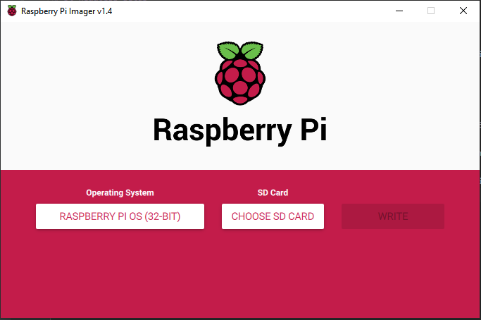

# pi_headless_setup

This is a guide to setting up a Raspberry Pi without a keyboard, mouse, or display for it. It emphasizes security and ease of use of the Pi going forward for projects.

Because we are doing this headless, most of the setup will be via the command line. This will teach a lot about the Unix operating system and command line.

You'll need: a Raspberry Pi Zero W, or a Raspberry Pi 3b+ or 4, a cable (micro USB if you have a Pi Zero or 3b+, USB C if you have a 4); a micro sd card (at least 8gb); a way to connect the micro sd card to your laptop (USB dongle or SD Card adaptor); a laptop; your home wifi (that you own).

## Preparing the Micro SD Card
In this section we will load the operating system onto the Micro SD Card, and set some default parameters for the first bootup of the Pi so that it will connect to your WiFi and allow an SSh connection so that we can connect to the Pi over the WiFI and give it commands.

The first thing to do is to plug your micro sd card into your personal laptop via a USB dongle or an SD Card Adaptor. From here, we'll need to download the operating system image. We'll use the Raspberry Pi Foundation's offical operating system, Raspberry Pi OS (formerly Raspian). The Raspberry Pi Foundation has a tool that will download the OS and flash the image onto your Micro SD Card, you can find the Raspberry Pi Imager [here.](https://www.raspberrypi.org/downloads/)

Download and launch the Raspberry Pi Imager and you'll be able to select an OS, select a micro SD Card, and flash it. I recommend the Raspberry Pi OS, but if you have reasons to go with a different OS (like you need something light-weight), you can pick another.   


From here, we'll need to enable ssh and setup the Pi to connect to your wifi on boot.

Note enabling SSH without any other steps is a security concern, as all Raspberry Pi OS images have a default user of Pi and a default password of raspberry. One of the first steps we'll do is create a new user and delete the existing pi user. If we didn't do this, anyone would be able to connect to your pi using the default username and password, and this is dangerous as they'd be inside your network and have control over your pi.

o enable SSH, create an empty file using a program like notepad and name it ssh. Be sure to delete any file extensions in the name or simply save it without any. Copy this to the boot volume of the micro ssd card (ie, the micro sd card). You can see the example of this file in the repo [here](./ssh).   


Now, create a new file named wpa_supplicant.conf, and populate it with the name of WiFi network and your password. Copy this to the boot volume/the micro SD Card. You can see an example of this file [here](./wpa_supplicant.conf) in the repo.


From here, you're set to insert the micro sd card into the Raspberry Pi and boot it up for the first time.

## First SSH connection, changing default user
In this section you will connect to the Raspberry Pi for the first time and fix a big security vulnerability by deleting the default user, pi.

First, you'll need to download an ssh client that will allow you to connect to the Pi--I use Moba Xterm but there are many options here. Here's Moba Xterm's site: https://mobaxterm.mobatek.net/. You could also use a command line tool like git bash for windows.

Now, you can put the Micro SD Card into your raspberry pi, plug the cable to the power socket, and then connect the cable to a power source (like your laptop's usb port).

From here, the Pi will bootup, enable SSH, and connect to your wifi network. It's at this point that we'll need to find its internal IP address so that we can ssh into it. There is various software to monitor your network and attached devices, but one easy way is to use your router's web interface. Most routers use an address of 192.168.1.1, entering this into a webbrowser's url bar should bring up a login prompt for your router's webpage. The default username and password are typically admin and admin or admin and password. It's worth changing these when you log in (but make sure you remember or write down the new password). [Here's](https://www.pcmag.com/how-to/how-to-access-your-wi-fi-routers-settings) a useful article in case you have trouble.

Once on your router's webpage, look for a section called attached devices or something similar, and look through the various devices connected to your wifi. Look for one that you don't recognize, and note down the ip address--this is likely your Pi!   


We can now connect to the Pi using our ssh interface, Moba Xterm. Launch Moba Xterm and create a new user session. Populate the remote host with the ip address you found just earlier.   
   


Hitting ok should launch the session, prompting you to login and enter your username and password. Enter the default user, pi, and the default password, raspberry to login.

You should now be logged into the Pi and see the command line, congrats! :balloon: :bell: :balloon: :tada:

Let's add another user and put it in the super users group. Choose a username, for instance, your first name, and enter the below commands replacing adam for your username. After entering the first command you'll be prompted to login as the user pi, to prove you can run the command as a super user. Upon creating the user you should be prompted for a new password for that user, change it to a new, strong password.
```
sudo adduser adam
sudo adduser adam sudo
```

Now let's set the root password to be the same as that new username password you just created. This will be helpful if in the far future you really mess stuff up and need to run commands as root:
```
sudo passwd root
```

Now, let's make it so that the pi boots to the command line, this will save us space as we're only going to use the pi headless. Enter the below command into the command line and enter the default user's password. Sudo means super user, so we'll need to enter our password to run this as a super user, and raspi-config will bring us to the configuration gui.   

```
sudo raspi-config
```

Using arrow keys and enter, navigate to boot options, Desktop / CLI, and select console. This will ensure the Pi boots without a GUI or a default user.

From here restart the pi by entering the below command. This will log you out and you'll have to start a new session after weighting 10 seconds or so by double clicking on your custom session in Moba Xterm.
```
sudo shutdown -r now
```

Once you the login prompt comes up, login as the new user you just created. From here, let's delete the Pi user. This will let you sleep a little more securely at night knowing that this security vulnerability is closed.
```
sudo deluser pi
```

From here I would go back to the raspi-config and set it to boot to the command line logged in as the user you just created (boot options, Desktop / CLI, and select Console Autologin)   
```
sudo raspi-config
```

I then like to create some basic directories in my user's home directory so that I have some structure. I find this is helpful in a chaotic world to find some grounding.
```
mkdir logs
mkdir Documents
```

From here, let's update everything and install git (again this is a security move to make sure you are protected with latest updates):
```
sudo apt-get update
sudo apt-get upgrade
sudo apt-get install git
```

## Optional Steps (ranked in order of importance)

### Loading a GitHub and creating SSH Keys for your Pi
Creating a GitHub and using that for your Pi's scripts is a good idea as version control is helpful when making changes, and its good to have backups in case you mess up and need to nuke everything.

To do this, go GitHub in a webbrowser on your laptop and create an account and a repo. I like to have a private repo for most stuff.

Then, let's generate SSH Keys for the pi and look at the public key. The first command will generate an ssh key for you. When prompted for a passcode, hit enter to skip adding one (it will ask twice). The second command will look at the created public key.
```
ssh-keygen
less ~/.ssh/id_rsa.pub
```

From here go to your GitHub account and add the public ssh key to your account (instructions [here](https://docs.github.com/en/free-pro-team@latest/github/authenticating-to-github/adding-a-new-ssh-key-to-your-github-account)). You can then copy your repo using ssh and setup your git. In the below command replace your repo info, and name and email.

```
cd ~
git clone git@github.com:mygithub_username/my_repo.git
git config --global user.name “Smarty Pants”
git config --global user.email pants@smarty.com
```

Now, when you add scripts to your Pi add them in this folder ~/my_repo, and be sure to commit and push to keep your GitHub up to date.

### Setup a Script to Update your Pi nightly
This is a good idea as you'll have the latest security (and other) updates.

First, we'll write a bash script that when run updates your pi and then restarts it. See the script here, typed out below:
```
#!/bin/sh
# printing some basic info like date and os versions
date
cat /etc/os-release
uname -a
# updating
sudo apt-get update && sudo apt-get upgrade -y
apt install openssh-server
sudo apt clean
# restarting the pi now
echo "Restarting now."
sudo shutdown -r now
```

It would be a good idea to put this into your git folder and add it to your repo. From here, we'll schedule this in the super user's crontab to run nightly, and save the output to a log file.

Go to the super user's crontab with the below command
$ touch /home/logs/cronUpdateLog
"
```
sudo crontab -e
```

We'll need to enter a new scheduled job with a new line at the bottom of the file to run the update. Below is an example of the syntax. Replace adam for your username, and the first path to the path of your shell script.

The below command will run at 3am, it will run the update.sh script and send the output into a file called cronUpdateLog.
```
00 3 * * * /home/adam/my_repo/update.sh >> /home/adam/logs/cronUpdateLog 2>&1 &   
```


If you're using Nano, use ctrl + o to save your changes, and then ctrl + x to exit the crontab.

From here, let's touch the cronUpdateLog file so that it exists and our update script can write to it.
```
touch ~/logs/cronUpdateLog
```

Great, your update shell script is all setup. Check back and look at the cronUpdateLog file after a day or two to ensure it has the records of the updates and all is working well.

### Setting up SSH keys to Login to the Pi (and disabling password authentication)
Some optional steps that will help secure your pi follow. Note these also may make it harder for you to get into your pi if you mess up and something goes wrong. See the GitHub section for notes about backups in case you need to nuke everything.

The first one is to set it up so that you can only loginto the Pi using ssh keys, which is very secure. That said, if you lose these ssh keys you're doomed and will have to erase the micro ssd card and re-install the os.

Let's first create ssh keys on your laptop. To do this, launch a local session on your laptop in Moba Xterm by creating a new tab without logging in to a host, and enter the below command.
```
ssh-keygen
```

Now, run the below command to add the public key to the Pi, entering your username on the Pi where it says user and the IP Address of the Pi where it says host. This should prompt you to login to the Pi.
```
ssh-copy-id -i ~/.ssh/mykey user@host
```

Let's set proper permissions for your authorized_keys file, so that owner has read/write, groups have read, and everyone has read.
```
sudo chmod 644 ~/.ssh/authorized_keys
```

From here, let's test that ssh connection is working before we disable password authentication. Go to Moba Xterm on your laptop and edit the user session you created, checking Use Private Key. It should default to your newly created keys location.


Hit OK and confirm that it logs you in and you see something like "Authenticating with Public Key" flash by in the command prompt. If this worked ok, you can proceed to disable password access to the Pi.

Edit the sshd_config file
```
sudo chmod 644 ~/.ssh/authorized_keys
```

And change the below lines to read as below:
```
ChallengeResponseAuthentication no
PasswordAuthentication no
UsePAM no
```

Great, reboot your pi and confirm that you can login through Moba Xterm. If you want, try to disable using private key and confirm it doesn't let you login.

### Setting up a Firewall and Fail2Ban
This section will help you install a firewall for your Pi, as well as software that will ban any ip if it fails a couple times to login. Again these are dangerous as if you mess things up it will prevent you from logging in too!

A firewall may help you avoid network activity that you don't allow, and fail2ban may help you avoid a brute force attack where someone tries to login many times very quickly trying different passwords.

Let's install uncomplicated firewall, allow ssh connections (that we use to connect to our pi) and then enable it.
```
sudo apt install ufw
sudo ufw allow ssh
sudo ufw enable
```

From here, let's install fail2ban, and change it so that you only have 3 tries to login.
```
sudo apt install fail2ban
sudo cp /etc/fail2ban/jail.conf /etc/fail2ban/jail.local
sudo nano /etc/fail2ban/jail.local
```

Inside the jail.local file, look for the sshd section (you can use ctrl + w to search in nano editor) and specifically change the lines to read as below:
```
[sshd]

port    = ssh
logpath = %(sshd_log)s
backend = %(sshd_backend)s
enabled = true
banaction = iptables-multiport
batime = -1
maxretry = 3
```

This will enable ssh connections (which we use to login to the pi) and set the maximum retries to be 3 before an IP is banned.

From here, restart the fail2ban service to activate it
```
sudo service fail2ban restart
```

### Setting a Static IP Address for the PI
Setting a static IP address will help you ensure that the IP Address for your PI doesn't change. In some respects, having the automatic configuration of network interfaces is nice as it means your ip address changes and that makes it harder for attackers to access your Pi. That said, it can be easier to know the ip address won't change over time.

To do this, we'll need to lookup the address of your gateway and domain name server which are usually both your router. Enter the below command and note down the gateway.
```
route -ne
```

Write down the ip address in the gateway column, and we'll edit the dhcpcd file accordingly.

```
sudo nano /etc/dhcpcd.conf
```

Add the below to the bottom of the file. Change the ip addresses for the one you currently have on the pi. It is 192.168.0.16 in the below example. Change the static router and static domain name server to be the gateway you wrote down above.
```
interface eth0
static ip_address=192.168.0.16/24
static routers=192.168.0.1
static domain_name_servers=192.168.0.1

interface wlan0
static ip_address=192.168.0.16/24
static routers=192.168.0.1
static domain_name_servers=192.168.0.1
```

From here, reboot your pi and ensure you can login!

### Setup Port Forwarding with your Router
This is useful so that you can login to your Pi from anywhere (any network) in the world! I use a phone app called Terminus that allows me to use this feature and login to my Pi when out and about.

Most of this will be in the router web page options. Most routers use an address of 192.168.1.1 (or 192.168.1.0), entering this into a webbrowser's url bar should bring up a login prompt for your router's webpage. The default username and password are typically admin and admin or admin and password. It's worth changing these when you log in (but make sure you remember or write down the new password). [Here's](https://www.pcmag.com/how-to/how-to-access-your-wi-fi-routers-settings) a useful article in case you have trouble.

Look for a section called Port Forwarding, that may be in advanced options. From here, you can set it so that if someone tries to login to a certain port, they are redirected to your Pi's IP Address.

Note your Pi's ip address, it should be printed in the left and look something like 192.168.0.16
```
hostname -I
```

Now, in port forwarding in your router sections, setup something like the below. In this example, when I connect to port 2033 from an external network, it'll forward it to my Pi and port 22.


From here, on your laptop check what your external IP Address is. I like to go to a site like [this](https://www.whatismyip.com/what-is-my-public-ip-address/).

Now, you can configure another user session in MobaXterm so that you can login to your Pi from a different network than it is connected to.

In user sessions, enter your external IP address, and the port that you setup in port forwarding on your router's login:


### Useful tidbits of knowledge

#### Enable run of script as sudo without password
This is convenient in some scenarios, like if you have a script always running on your Pi as a regular user and need it to be able to run another script at various times, like when a button is pushed, as sudo. That said, it is a security concern, so there's always that tradeoff.

```
sudo visudo
```

Put the below line in the file at the end. This will let you run the listed scripts without a sudo password. In the below example user Adam will be able to run the update.sh script and the auto_watch.py script as Sudo without entering a password.
```
adam ALL = NOPASSWD: /home/adam/my_repo/update.sh,/home/adam/my_repo/auto_watch.py
```
